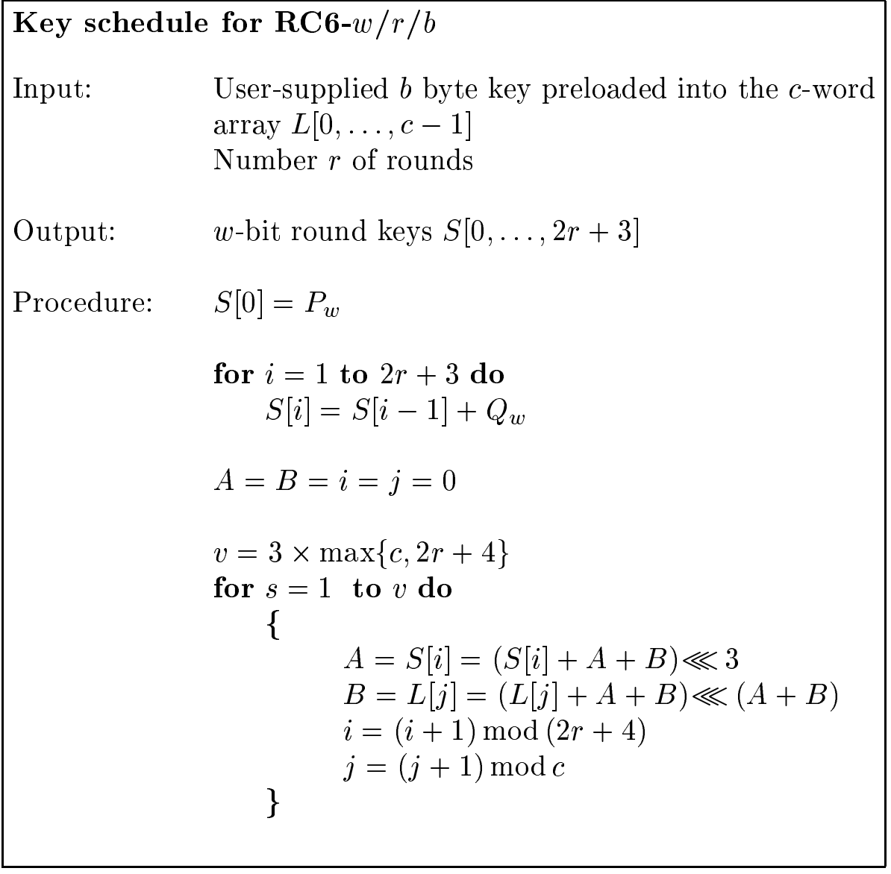
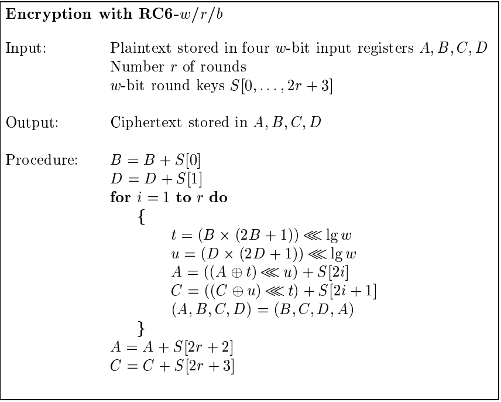
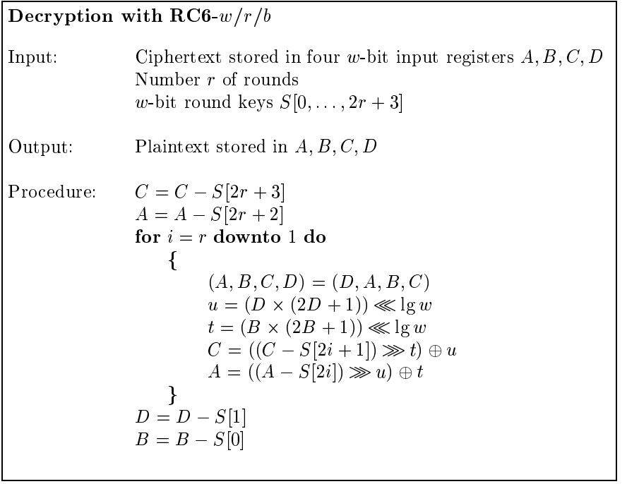

# RC6
- Very much the same as RC5, but with subtle differences
- 128-bit block cipher
  - Uses four 32-bit registers rather than two 64-bit
- Uses processors more efficiently thus faster diffusion than RC5
  - Fewer rounds
  - Increased security
  - Increased throughput
  
# Basic Operation
w= word size in bits, r =rounds, b = length of encryption key in bytes  

- a+b :integer addition modulo 2w
- a-b :integer subtraction modulo 2w
- a^b :bitwise xor of w-bit words
- axb :integer multiplication modulo 2w
- a<<<b :rotate the w-bit word a to the left by the amount given by the least significant lg w bits of b
- a>>>b :rotate the w-bit word a to the right by the amount given by the least significant lg w bits of b

# Key Generator

# Encryption

# Decryption

